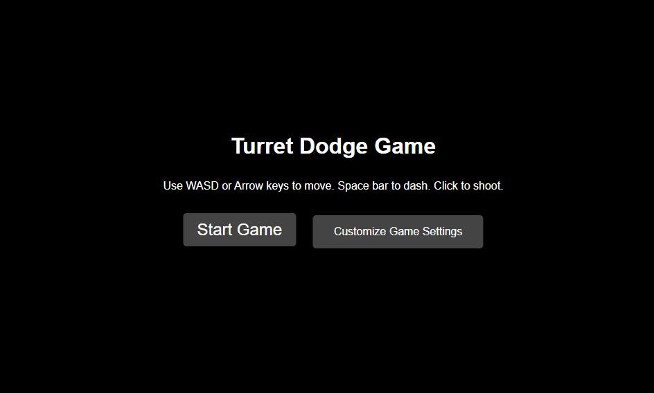
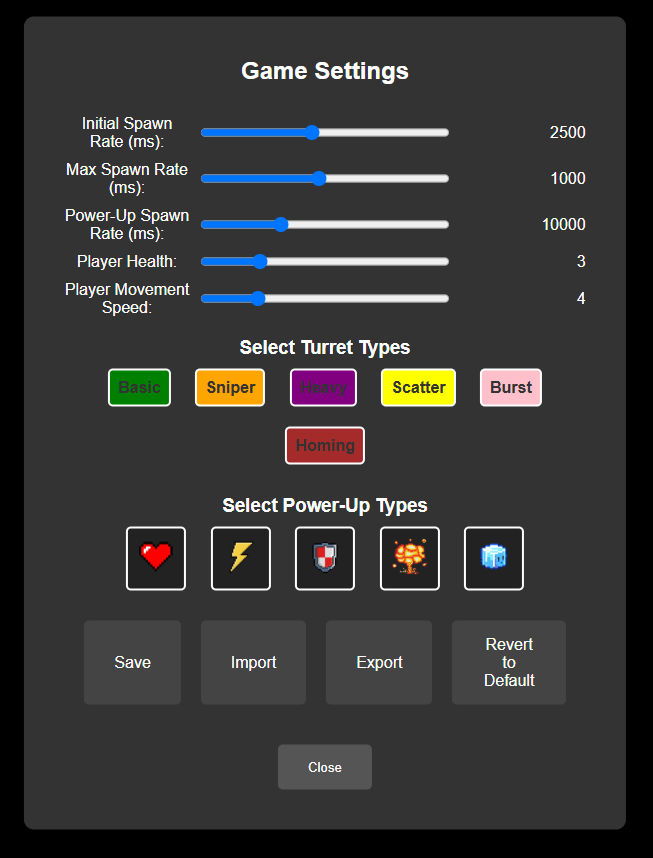
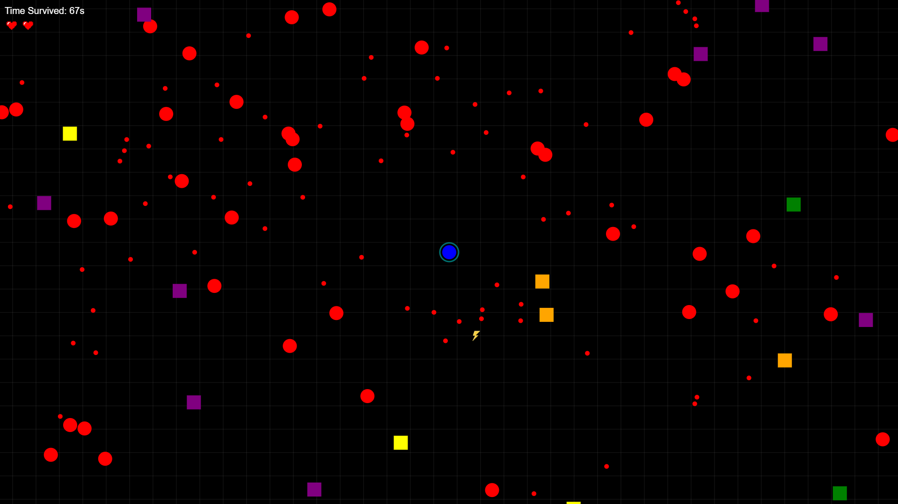

# Turret Dodge Game

Turret Dodge Game is a simple browser-based game where the player must dodge bullets fired by turrets and shoot back to destroy them. The game gets progressively harder as time goes on.

## Table of Contents

- [Screenshots](#screenshots)
- [Installation](#installation)
- [Usage](#usage)
- [Game Mechanics](#game-mechanics)
- [Controls](#controls)
- [Contributing](#contributing)

## Screenshots

### Start Screen



### Settings Screen



### Gameplay



## Installation

1. Clone the repository:
   ```sh
   git clone https://github.com/jasonli2446/turret-dodge-game.git
   ```
2. Navigate to the project directory:
   ```sh
   cd turret-dodge-game
   ```

## Usage

1. Enter

```sh
npx live-server
```

to start the game

## Game Mechanics

- The player starts in the middle of the screen.
- Turrets spawn at random locations and shoot bullets at the player.
- The player can move around the screen and shoot bullets to destroy turrets.
- The game ends when the player's health reaches zero.
- The player's score is based on the time survived.

## Controls

- **W / Arrow Up**: Move up
- **S / Arrow Down**: Move down
- **A / Arrow Left**: Move left
- **D / Arrow Right**: Move right
- **Mouse Click**: Shoot bullet
- **Space Bar**: Dash

## Contributing

Contributions are welcome! Please open an issue or submit a pull request for any improvements or bug fixes.
